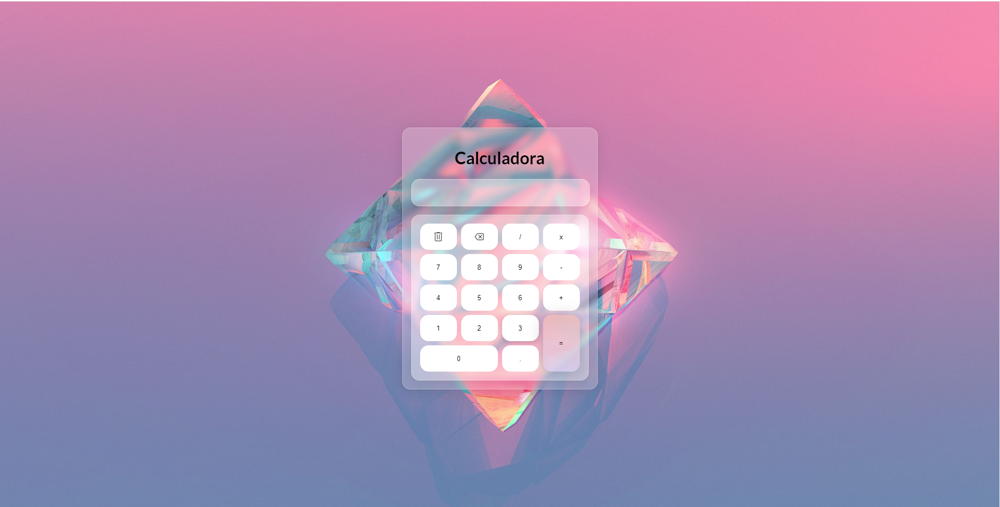

# Calculadora Simples em HTML, CSS e JavaScript

> Este é um projeto de uma calculadora simples desenvolvida usando tecnologias web básicas: HTML, CSS e JavaScript.

---

## Funcionalidades

- Adição, subtração, multiplicação e divisão.
- Limpar (🗑) para limpar a entrada.
- Botão de igual para obter o resultado.

## Pré-requisitos

Para executar o projeto localmente, basta um navegador web padrão.

## Como Executar

1. Clone este repositório ou faça o download do código-fonte.
2. Abra o arquivo `index.html` em um navegador web.
